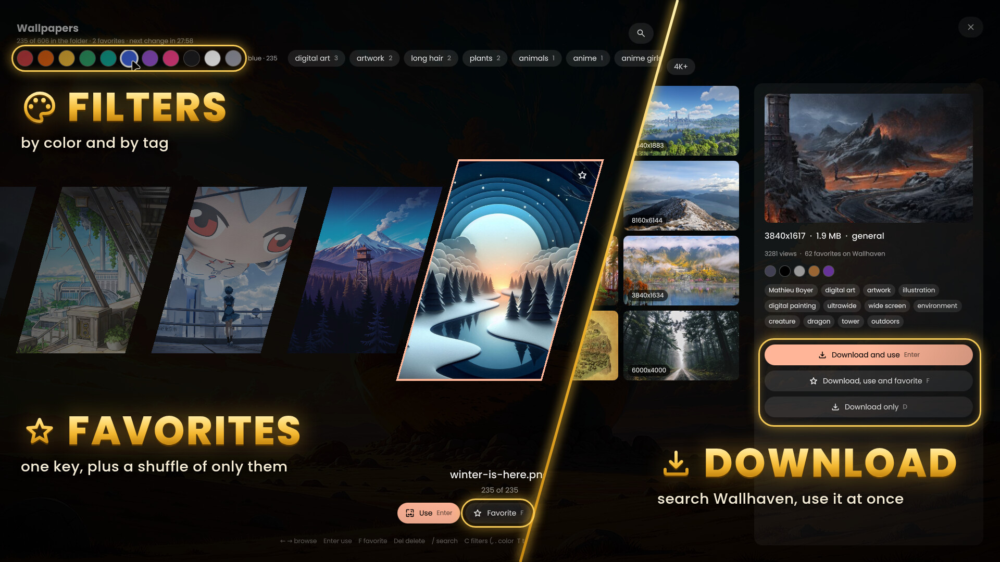

<div align="center">

# Wallhaven Carousel

**Pick, favorite, filter and download wallpapers without leaving [DankMaterialShell](https://github.com/AvengeMedia/DankMaterialShell).**

A fullscreen skewed carousel of your wallpaper folder, with favorites, color and tag filters,<br>
a shuffle that only picks favorites, and Wallhaven search, full-size preview and download in the same overlay.

[](https://github.com/AvengeMedia/DankMaterialShell)
[](https://wallhaven.cc)
[](LICENSE)

[The carousel](#the-carousel) · [Favorites and filters](#favorites-and-filters) · [Wallhaven](#wallhaven-built-in) · [Install](#install) · [Keys](#keys) · [IPC](#ipc)



</div>

## The carousel


Press your key and every wallpaper in the folder lines up in a skewed carousel. Click a card, scroll the wheel or use the arrow keys (`h` and `l` work too). `Enter`, or a click on the centered card, sets it as your wallpaper.

The wallpaper you are using carries an "in use" badge, and the carousel opens centered on it. If DMS changes your wallpaper on a timer, the header counts down to the next change, and picking one by hand restarts that interval.

## Favorites and filters


- `F`, or the star on a card, marks a favorite. `Tab` shows favorites only.
- `R` starts a shuffle among favorites only, every 5 minutes to 6 hours. DMS's own timer pauses while it runs and comes back as it was when you turn the shuffle off.
- `C` opens the filters. Each color dot keeps the wallpapers where that color dominates: red, orange, yellow, green, teal, blue, purple, pink, dark, light or gray. The colors come from the images. A small Python script reads each file once with ImageMagick, in the background, and caches the result.
- Wallpapers downloaded from Wallhaven bring their Wallhaven tags, and the most common tags become filters next to the colors.
- `/` searches by file name or tag.

## Wallhaven built in


`A` opens a [Wallhaven](https://wallhaven.cc) search in the same overlay, SFW only, with no account or API key. Choose the categories (General, Anime, People), sort by top of the month, latest, most viewed, most favorited, relevance or random, and set a minimum size of 1080p, 1440p or 4K. `Load more` brings the next page. The side panel shows the resolution, file size, views, palette and tags of the selected wallpaper.

| Key | Button | What happens |
| --- | --- | --- |
| `Enter` | Download and use | Downloads it to your folder and sets it |
| `F` | Download, use and favorite | Also adds it to your favorites |
| `D` | Download only | Adds it to the folder for later |

Downloads are named `wallhaven-<id>.<ext>`. Each one goes to a `.part` file and is renamed when complete, so the carousel never shows half an image.

### See it full size before you download

`Space`, a double click on a result, or a click on the picture in the side panel opens the wallpaper full screen. A small copy shows at once, and the original fades in over it, with a progress bar while it loads. `Tab`, or a click on the picture, switches between the whole picture and filling the screen the way it would sit as your wallpaper. The arrow keys and the wheel go to the next or previous result, `Enter`, `F` and `D` download from there, and `Esc` goes back to the results.

The originals you open are kept in `~/.cache/DankMaterialShell/wallhavenCarousel/preview` for 30 minutes, and the next and previous results are fetched and decoded ahead, so stepping through doesn't wait on the network. Downloading one you already previewed copies it from there.

## Delete to the Trash

`Del` asks first, then moves the file to the Trash with `dms trash`, where you can restore it. If it was the wallpaper in use, the next card becomes the wallpaper before the file goes.

The [full demo video](https://github.com/alicercedigital/wallhaven-carousel/releases/download/v1.0.0/demo.mp4) runs 38 seconds.

## Install

You need:

- DankMaterialShell 1.6.0 or later, managing your wallpaper (Settings → Wallpaper). The plugin sets wallpapers through DMS, so swww, hyprpaper and swaybg setups won't see its changes.
- `python3` and ImageMagick for the color filter. Everything else works without them, and the color dots stay empty.

From the DMS plugin browser, open Settings → Plugins → Browse and pick Wallhaven Carousel. From a terminal:

```sh
dms plugins install wallhavenCarousel
```

Or by hand:

```sh
git clone https://github.com/alicercedigital/wallhaven-carousel \
  "${XDG_CONFIG_HOME:-$HOME/.config}/DankMaterialShell/plugins/wallhavenCarousel"
dms restart
```

Then turn it on in Settings → Plugins and bind a key to `dms ipc call wallhavenCarousel toggle`. On Hyprland, DMS writes the bind for you:

```sh
dms keybinds set hyprland "SUPER + SHIFT + Tab" "exec dms ipc call wallhavenCarousel toggle" --desc "Wallhaven Carousel"
```

On niri, add it to the `binds` block of `config.kdl`:

```kdl
Mod+Shift+Tab { spawn "dms" "ipc" "call" "wallhavenCarousel" "toggle"; }
```

## Keys

In the carousel:

| Key | Action |
| --- | --- |
| `←` `→` or `h` `l`, wheel | Move between wallpapers |
| `PgUp` `PgDn`, `Home` `End` | Jump 5, or to either end |
| `Enter` | Set the centered wallpaper and close |
| `F` | Favorite or unfavorite it |
| `Del` or `D` | Move it to the Trash, after asking |
| `/` | Search by name or tag |
| `Tab` | Favorites only |
| `C` | Show or hide the filters |
| `,` `.` | Previous or next color filter |
| `T` | Next tag filter |
| `R` | Favorites shuffle on or off |
| `A` | Wallhaven search |
| `Esc` | Clear the search, then the filters, then close |

In Wallhaven search, the arrow keys move through the results, `Space` opens the full-size preview, `/` jumps to the search field, `Enter`, `F` and `D` download as in the table above, and `Esc` goes back to the carousel.

## IPC

```sh
dms ipc call wallhavenCarousel toggle                        # open or close the carousel
dms ipc call wallhavenCarousel open
dms ipc call wallhavenCarousel discover                      # open straight into Wallhaven search
dms ipc call wallhavenCarousel close
dms ipc call wallhavenCarousel favorite                      # favorite or unfavorite the wallpaper in use
dms ipc call wallhavenCarousel random                        # switch now to a random favorite
dms ipc call wallhavenCarousel favoritesRandom on|off|toggle  # the favorites shuffle
```

## Settings

In Settings → Plugins → Wallhaven Carousel:

- **Wallpaper folder.** Left empty, the plugin uses the folder DMS cycles through, or else the folder of the current wallpaper. `~` works.
- **Shuffle favorites every.** 5, 15 or 30 minutes, or 1, 3 or 6 hours.

## How it works with DMS

DMS keeps control of the wallpaper, and the plugin only chooses the file. Your fill mode, transitions and matugen colors keep working. With per-monitor wallpapers on, a pick in the carousel goes to the monitor it opened on, and a Wallhaven download goes to every monitor.

Favorites and Wallhaven tags are saved by file name in `plugin_settings.json`, next to your other DMS plugin settings. The color cache is `~/.local/state/DankMaterialShell/wallhavenCarousel/colors.json`. Downloads and API calls go through `dms dl`, and Trash through `dms trash`.

Wallhaven's API allows 45 requests a minute. The plugin fetches tags one file at a time, 1.5 seconds apart, and tells you when Wallhaven is rate limiting a search.

## Translations

The plugin ships in English and Portuguese and follows your DMS language. To add one, copy `translations/pt.json` to `translations/<locale>.json` (for example `de.json` or `zh_CN.json`), translate the values and open a pull request.

## Credits

Search results, tags and downloads come from the [Wallhaven API](https://wallhaven.cc/help/api). This project has no affiliation with Wallhaven. The wallpapers in the screenshots belong to their artists.

## License

[MIT](LICENSE)
